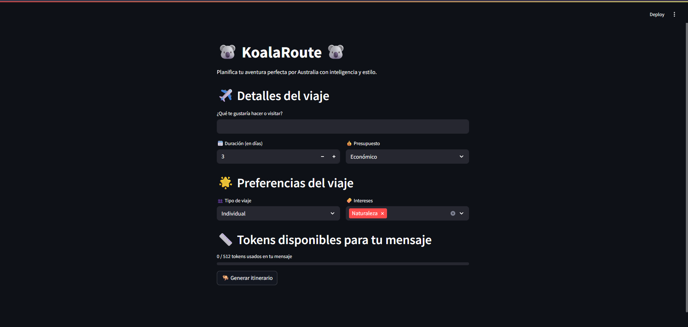

<p align="center">
  
  
  
</p>

<p align="center">
  <a href="docs/TFM_Utica_Maxim.pdf" download>
    
  </a>
</p>

# 🐨 Koala Route 🐨
Este proyecto implementa un sistema de Recuperación y Generación Aumentada (RAG) que:

- Usa Azure Cognitive Search como almacén vectorial para realizar recuperación semántica eficiente. 
- Utiliza Azure OpenAI (GPT-3.5-Turbo) para la generación de respuestas mediante LangGraph. 
- Integra un orquestador de agentes con LangGraph para gestionar el flujo de recuperación y generación de manera modular.
- Emplea un modelo de embedding de Azure OpenAI (text-embedding-3-large) para convertir documentos y consultas en vectores, garantizando compatibilidad total con el índice configurado en Azure Search.
- Dispone de interfaz web con Streamlit para una interacción amigable y evaluación de escenarios de prueba.
- Soporta gestión de tokens y límites de uso para optimizar el coste de las llamadas a la API.
- Utiliza `.env` para una gestión segura y centralizada de credenciales y endpoints de Azure.

---

🧠 Project Overview
Title: Generación Aumentada con LLMs y Orquestación Multiagente para Planificación de Viajes  
Author: Maxim Utica Babyak  
Degree: Máster Universitario en Inteligencia Artificial  
University: Universidad Alfonso X El Sabio (UAX)  
Date: Junio 2025  
Language: Spanish  

Este proyecto implementa un sistema completo de recuperación semántica y generación de texto, evaluado bajo escenarios controlados, con enfoque en eficiencia, calidad de resultados y orquestación modular mediante agentes.

Puedes leer el TFM completo aquí:  
📘 [TFM_Utica_Maxim.pdf](docs/TFM_Utica_Maxim.pdf)

---

## 🚀 Requisitos

- Python **3.12**  
- Dependencias gestionadas con `pyproject.toml`  
- Archivo `.env` configurado con credenciales de Azure

---

## 📸 Preview


## ⚡ Instalación

### 1. Crea y activa un entorno virtual

En Linux/macOS:

```bash
python3 -m venv .venv
source .venv/bin/activate
```

En Windows:

```bash
python -m venv .venv
.venv\Scripts\activate
```

---

### 2. Instala las dependencias del proyecto

```bash
pip install .
```

Si quieres también herramientas de desarrollo:

```bash
pip install ".[dev]"
```

---

### 3. Crea y configura tu archivo .env

```ini
# 🔎 Azure Cognitive Search
AZURE_SEARCH_ENDPOINT=https://<tu-endpoint>.search.windows.net
AZURE_SEARCH_KEY=<tu-clave-secreta>

# 🤖 Azure OpenAI para generación
AZURE_OPENAI_ENDPOINT=https://<tu-endpoint-openai>.openai.azure.com/
AZURE_OPENAI_API_KEY=<tu-api-key>
AZURE_OPENAI_DEPLOYMENT=<nombre-del-deployment-de-generación>

# 📐 Azure OpenAI para embeddings
AZURE_OPENAI_EMBEDDINGS_ENDPOINT=https://<tu-endpoint-openai>.openai.azure.com/
AZURE_OPENAI_EMBEDDINGS_API_KEY=<tu-api-key-embeddings>
AZURE_OPENAI_EMBEDDINGS_DEPLOYMENT=<nombre-del-deployment-de-embeddings>
```

---

## 🧪 Uso

### Ejecutar interfaz web principal (planificador de viajes)

```bash
streamlit run webapp/app.py
```

Permite planificar viajes con filtros de duración, presupuesto e intereses, generando itinerarios personalizados.

---

### Ejecutar interfaz de evaluación de escenarios de prueba

```bash
streamlit run webapp/app_test.py
```

Permite seleccionar escenarios YAML predefinidos, ejecutar el sistema RAG y visualizar:

- La respuesta generada por el modelo (itinerario).

- Los documentos recuperados desde Azure Cognitive Search.

- Métricas de evaluación como Recall adaptativo y Coherencia Semántica para comprobar el rendimiento del sistema.

---

### Subir documentos al índice Azure Cognitive Search
Los documentos deben estar almacenados en ``DOCS_PATH``, constante definida en ``config.py``

```bash
python uploader.py --file info.md
```

```bash
python uploader.py --all
```

---

### Eliminar documentos del índice de Azure Cognitive Search
```bash
python deleter.py --id <id_documento> <id_documento_2> ...
```

```bash
python deleter.py --all
```
---

## 📂 Estructura del proyecto

```
koalaRoute/
├── config/
│   ├── config.py
|   ├── prompts.yaml
|   ├── test_cases.yaml
|   └── ui_options.yaml
├── data/
│   └── template.md
├── modules/
│   ├── agents/
|   |   ├── controller_agent.py
|   |   ├── llm_agent.py
|   |   └── retriever_agent.py
│   ├── graph/
|   |   ├── agent_state.py
|   |   └── graph.py
│   ├── llm.py
│   ├── prompt_utils.py
│   └── vector.py
├── webapp/
│   ├── evaluations/
|   |   ├── evaluator.py
|   |   └── scenario_utils.py
│   ├── app_test.py
│   ├── app.py
|   └── runner.py
├── main.py
├── uploader.py
├── deleter.py
├── .env
├── pyproject.toml
└── README.md
```

---

## ✅ Estado

- Orquestación funcional con LangGraph, integrando Azure OpenAI (GPT-3.5-Turbo) y Azure Cognitive Search.
- Embeddings gestionados desde Azure OpenAI, compatibles con el índice vectorial configurado en Azure Search.
- Interfaz web en Streamlit con selección de escenarios de prueba, visualización de resultados y control de generación.
- Evaluación automática de respuestas mediante métricas como Recall@k y coherencia semántica.
- Gestión de tokens optimizada con tiktoken para prevenir sobrecostos en llamadas al modelo.
- Variables sensibles y configuración externa gestionadas mediante `.env`.
- Incluye scripts y documentación para subir, eliminar y administrar documentos en el índice vectorial.

---

## 📌 Notas

- El sistema está preparado para cambiar fácilmente entre LLM local y Azure OpenAI.
- Soporta extensiones para guardar itinerarios, historial, y futuras integraciones con FastAPI o Gradio.
- Se recomienda usar entorno virtual y evitar instalar dependencias globalmente.
- Ajusta límites de tokens y prompts para optimizar costos en Azure OpenAI.
